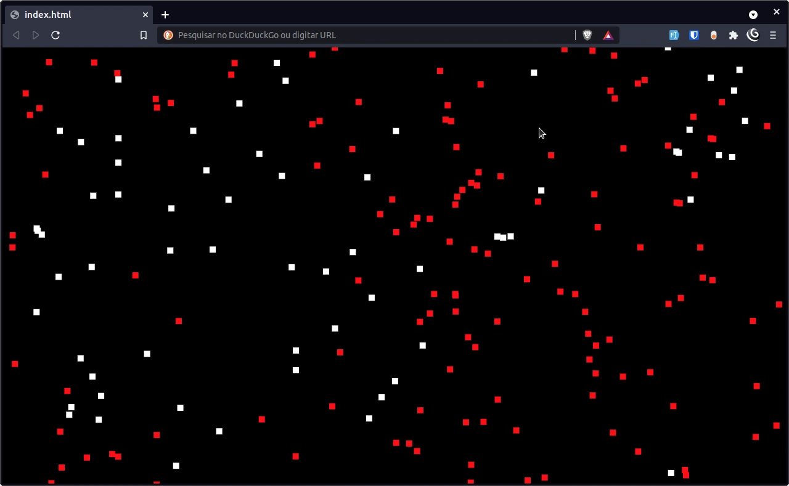

# Particles

This is just a vanilla js experiment.

There are many white particles moving randomly on the screen. Initially, there is a red particle, when it collides with a white one, the white one becomes red, triggering a chain reaction.

## It's alive

[https://endopedro.github.io/particles/](https://endopedro.github.io/particles/)

## Screenshot

## To run it

Just open the **index.html** file in any browser.
